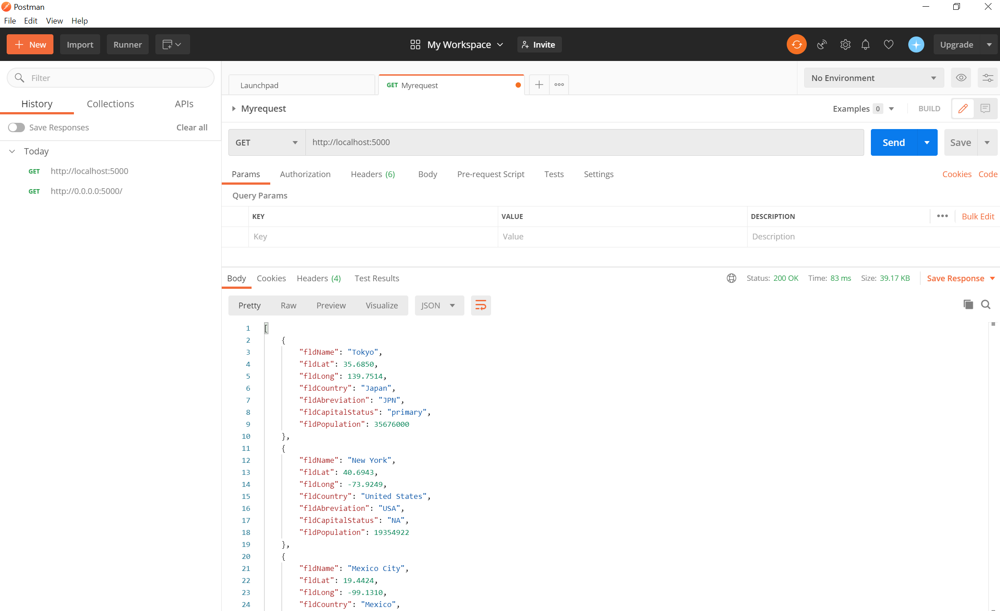
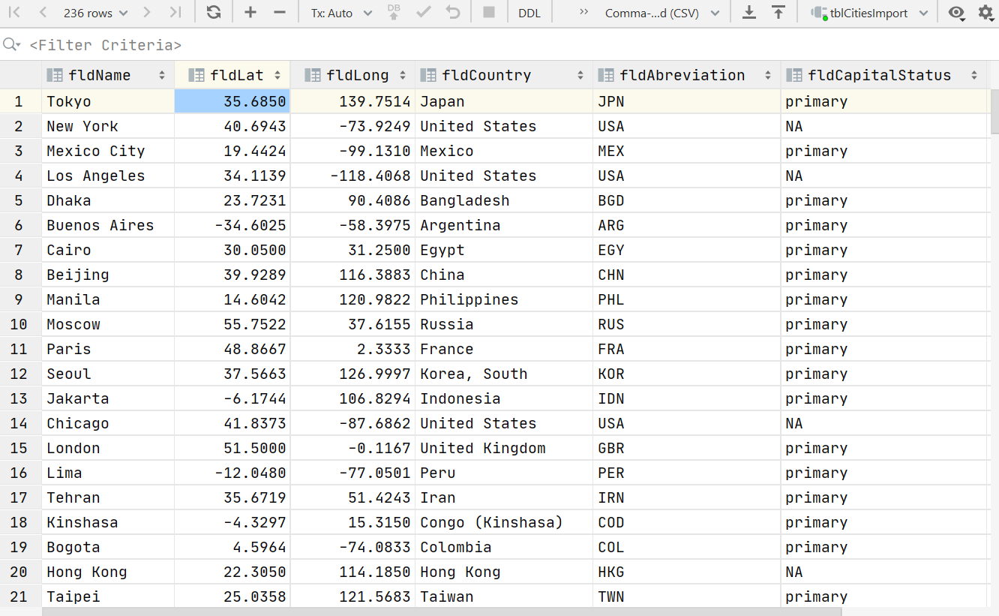

# Project Description
This project is homework assignment to teach how to get Pycharm setup with Docker
[Download Assignment Here]()
[View Assignment Video Here]()
# Postman screenshot

# SQL Data Screenshot
